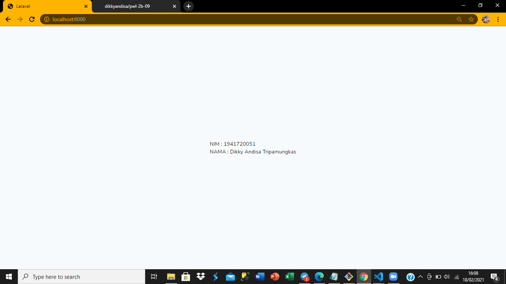

# 01 - Hello World

## Tujuan Pembelajaran

1. mahasiswa mampu mengkonfigurasi dan instalasi laravel
2. mahasiswa mampu memahami tujuan pembelajaran

## Hasil Praktikum

hasil tampilan merubah nim dan nama

[kode program](../../src/01_hello_world/welcome.blade.php)
