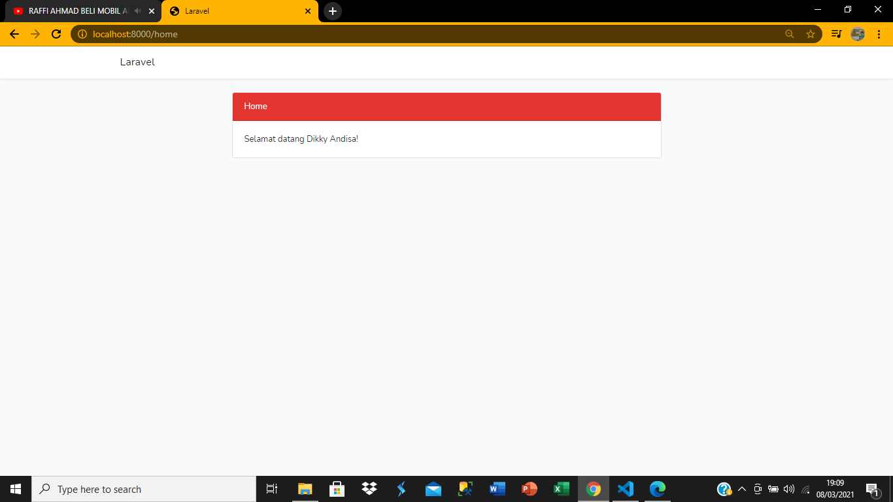
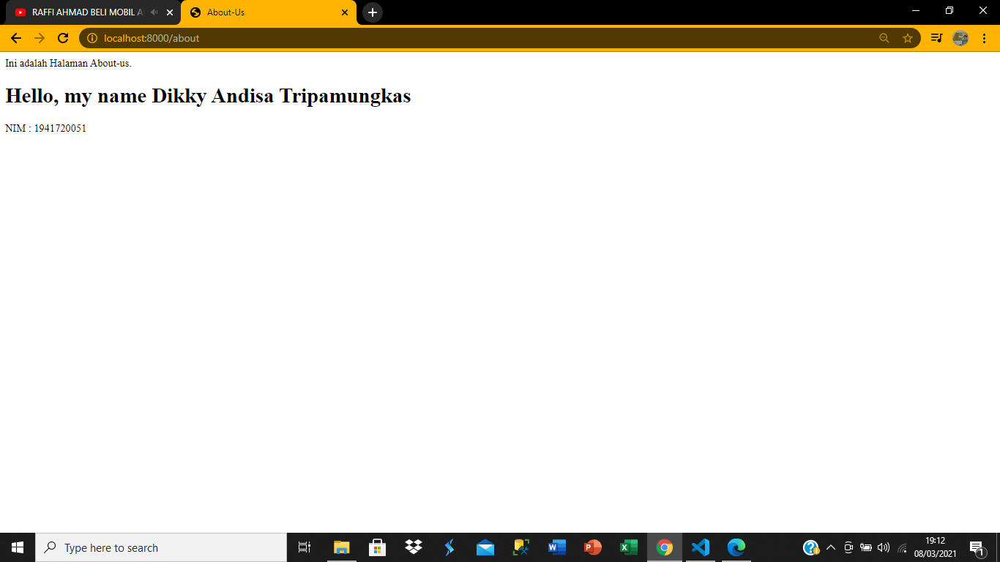
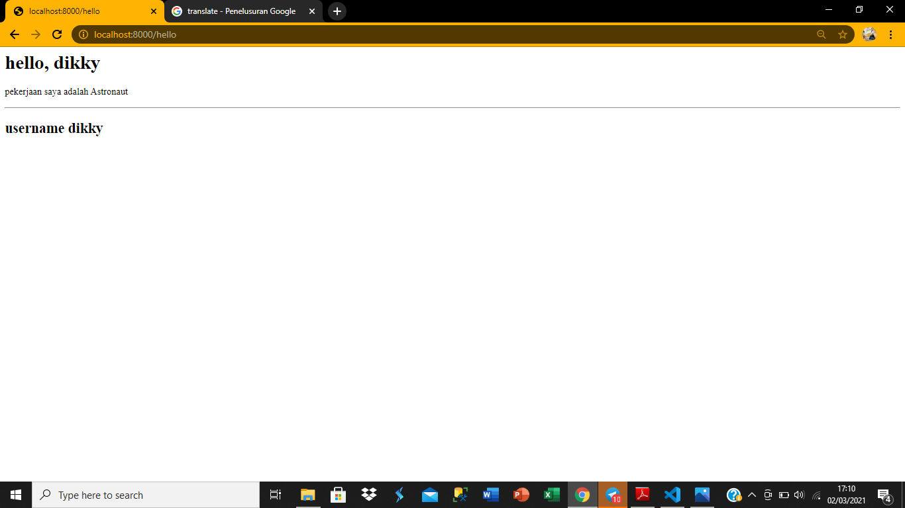
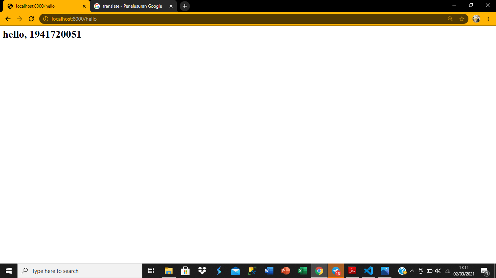

# 03 - View

## Tujuan Pembelajaran

1. Mahasiswa memahami konsep view dalam Web Framework
2. Mahasiswa menerapkan template engine pada view Web Framework
3. Mahasiswa melakukan pe-layout-an pada view Web Framework

## Hasil Praktikum

### praktikum 3:

[kode program](../../src/03_view/praktikum-1/web.php)
[kode program](../../src/03_view/praktikum-1/about-us.blade.php)
[kode program](../../src/03_view/praktikum-1/home.blade.php)
