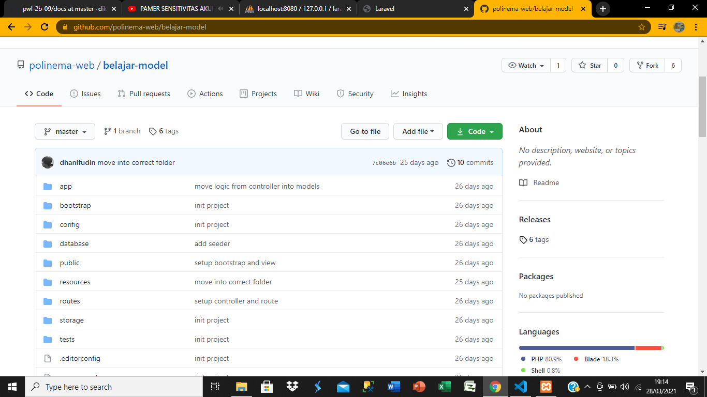
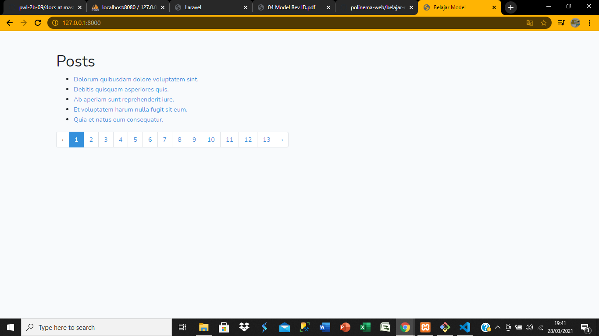

# 04 - model

## Tujuan Pembelajaran

1. Mahasiswa mampu memahami konsep model pada Web Framework
2. Mahasiswa mampu membuat koneksi ke database
3. Mahasiswa mampu membuat schema migrations
4. Mahasiswa mampu membuat seeder

## Hasil Praktikum

### praktikum 1

