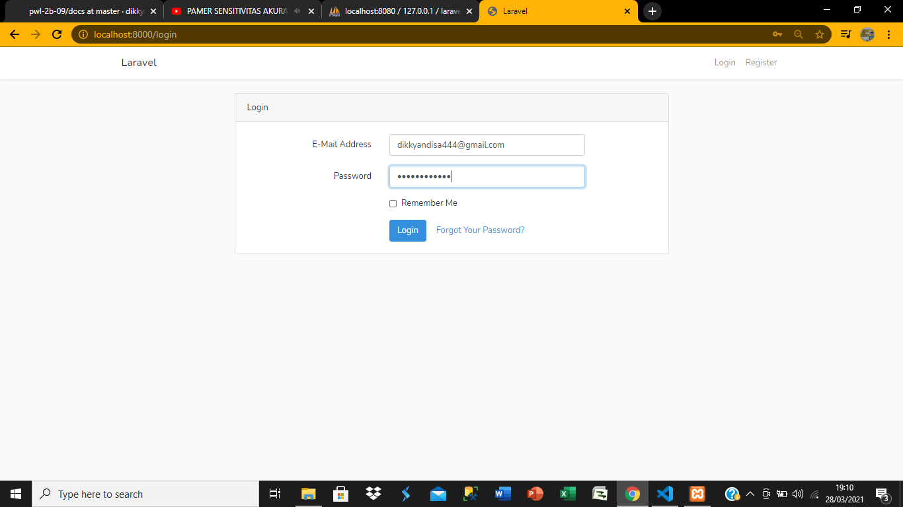
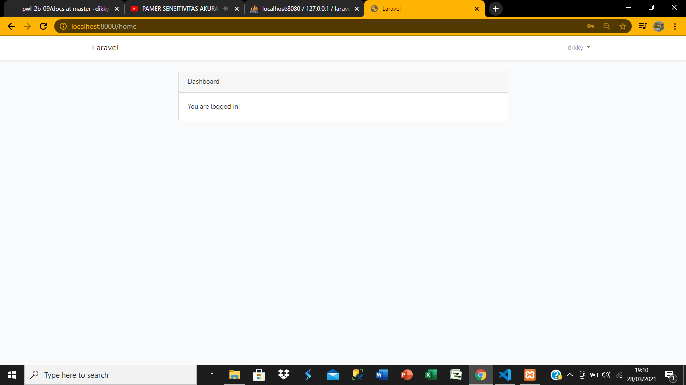
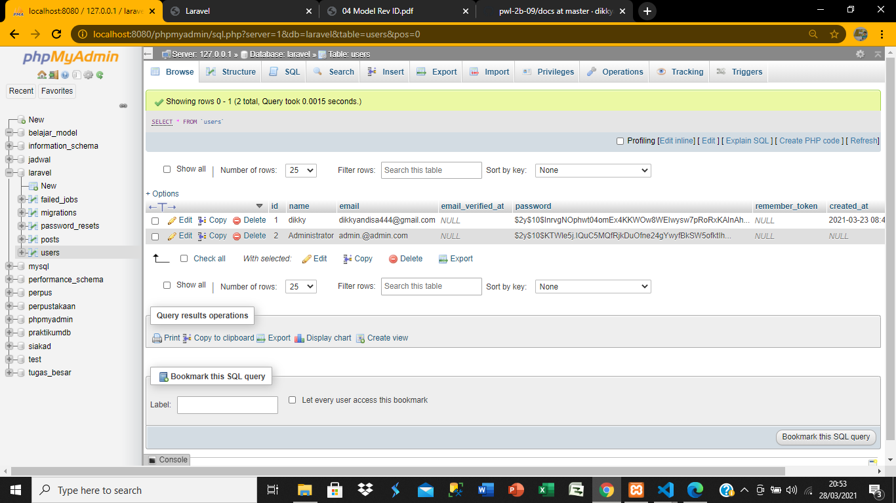
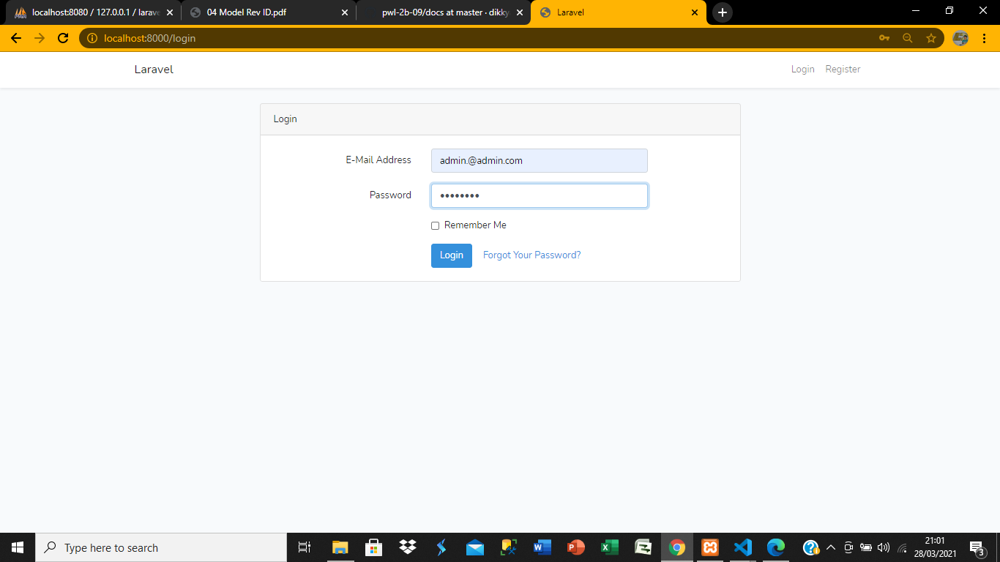
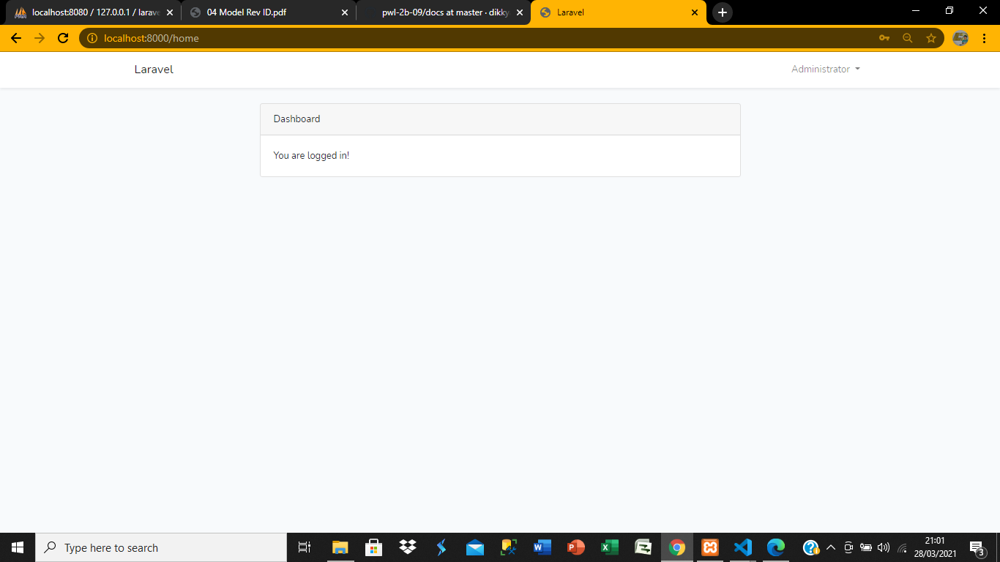
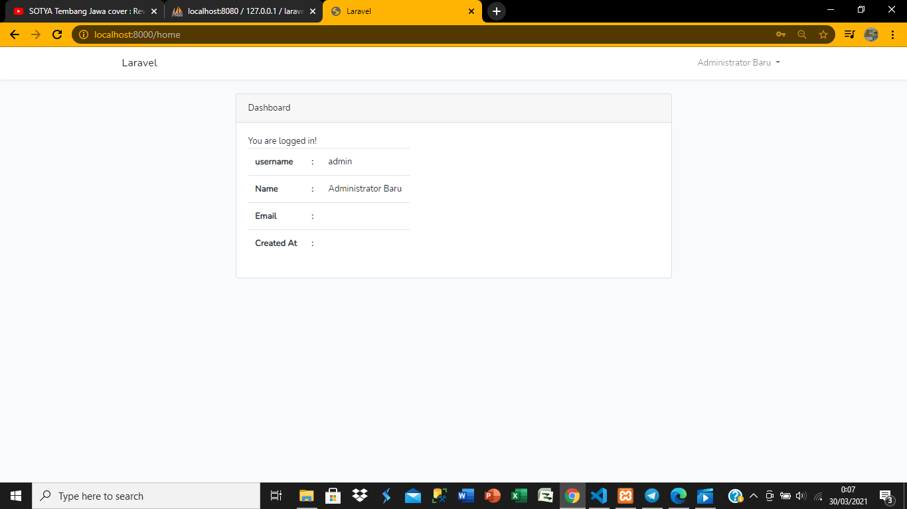
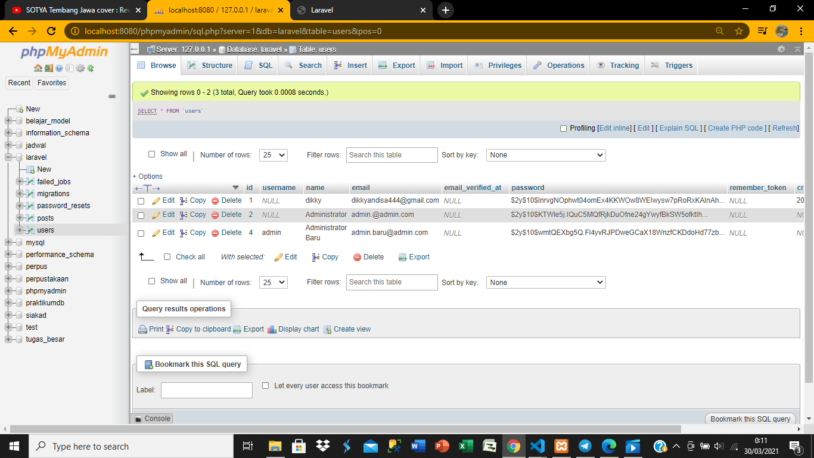

# 06 - autentikasi

## Tujuan Pembelajaran

1. Mahasiswa mampu memahami konsep authentication
2. Mahasiswa mampu membuat custom authentication

## Hasil Praktikum

### praktikum 1

### praktikum 2

### praktikum 3

