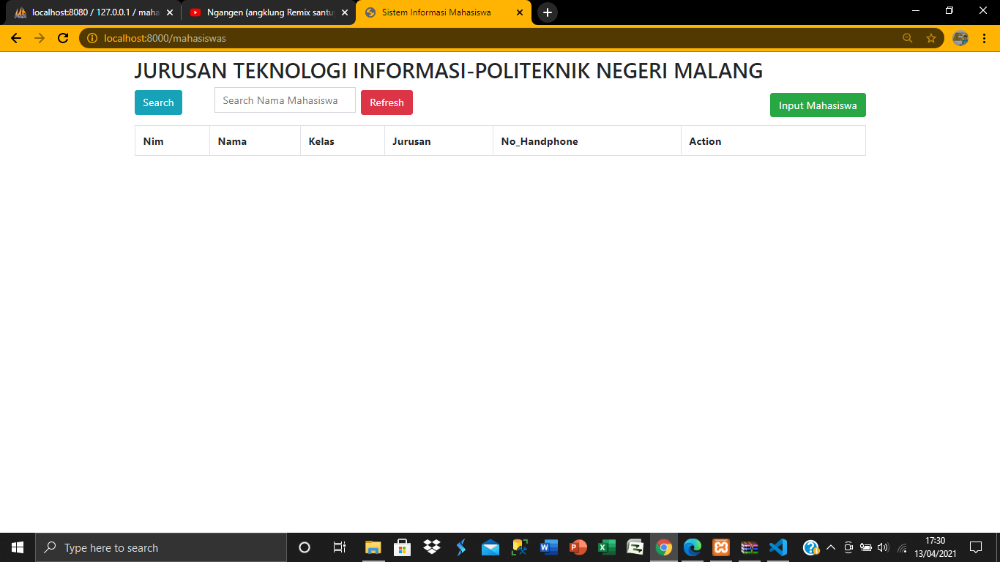
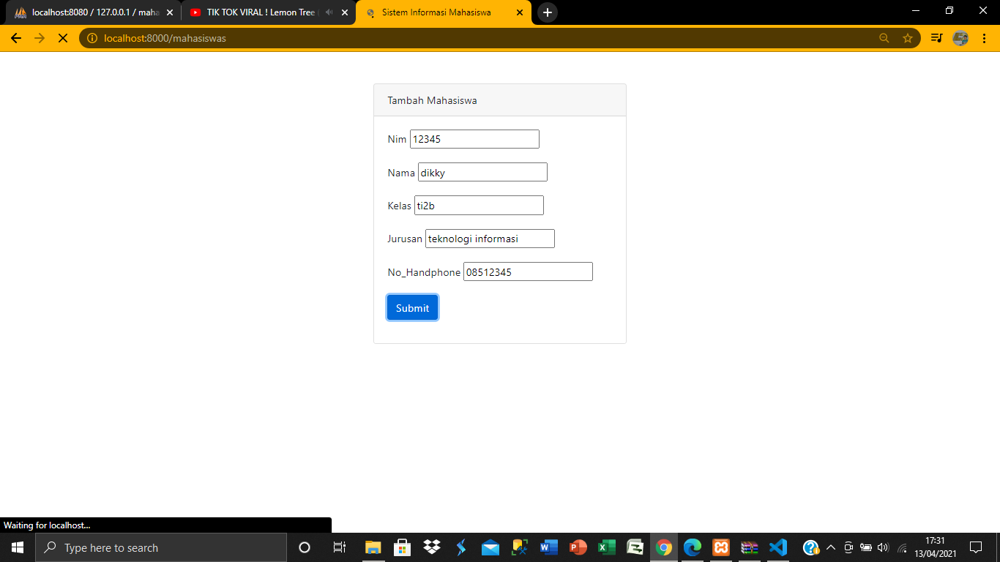
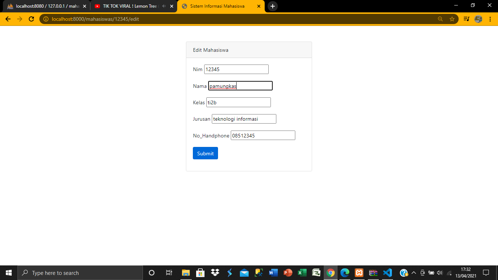
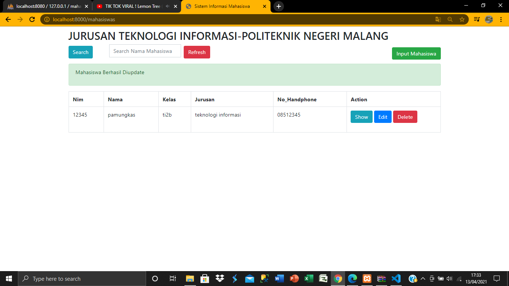
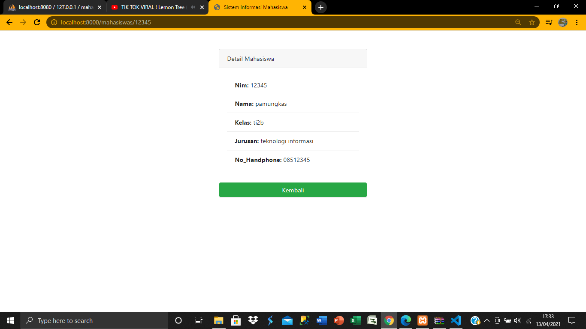
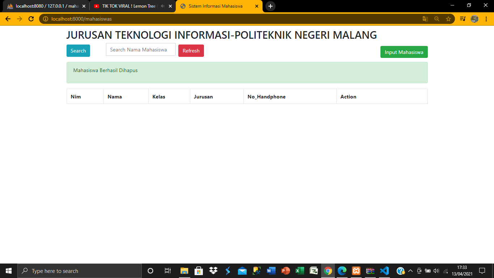
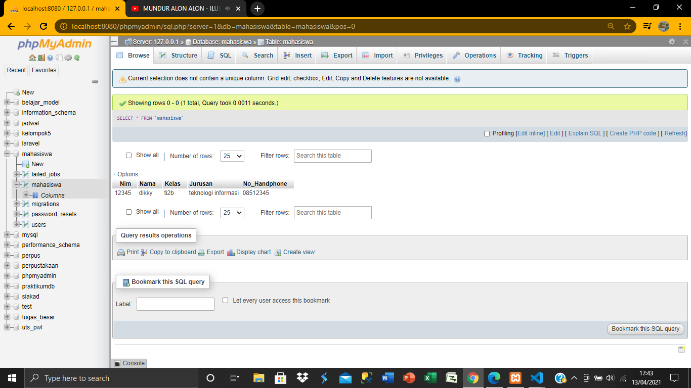
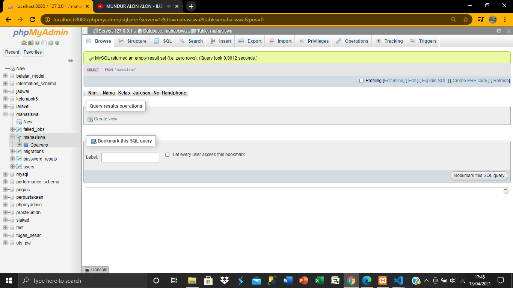

# 07 - ORM ELOQUENT DAN CRUD

## Tujuan Pembelajaran

1. Mahasiswa mampu memahami konsep ORM
2. Mahasiswa mampu melakukan operasi CRUD dengan ORM

## Hasil Praktikum

### praktikum 

[kode program](../../src/07_ORM/web.php)
[kode program](../../src/07_ORM/MahasiswaController.php)
[kode program](../../src/07_ORM/2021_03_30_074335_create_create_mahasiswa_tables_table.php)
[kode program](../../src/07_ORM/Mahasiswa.php)

### view

[kode program](../../src/07_ORM/cari.blade.php)
[kode program](../../src/07_ORM/create.blade.php)
[kode program](../../src/07_ORM/detail.blade.php)
[kode program](../../src/07_ORM/edit.blade.php)
[kode program](../../src/07_ORM/index.blade.php)
[kode program](../../src/07_ORM/layout.blade.php)

