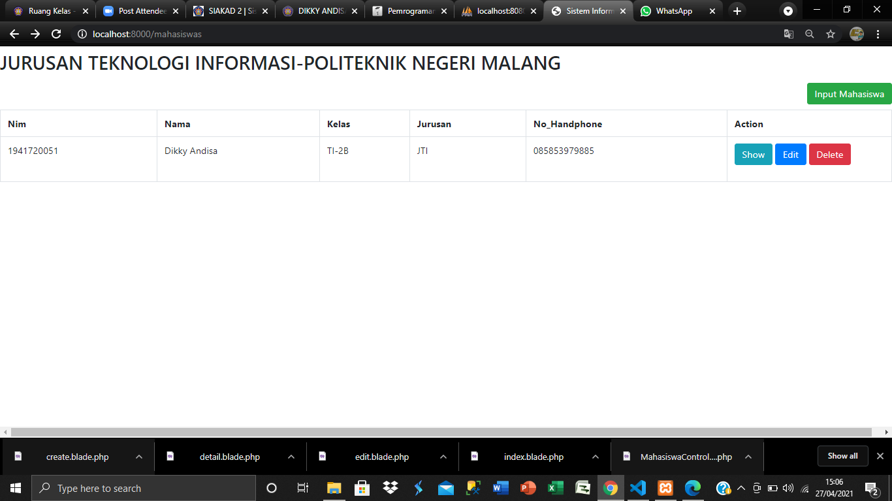
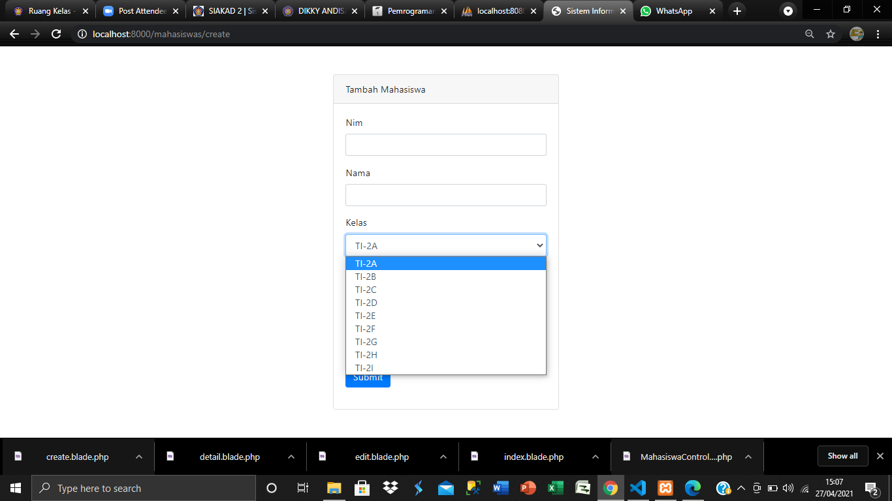
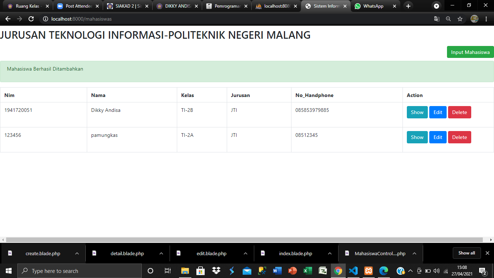
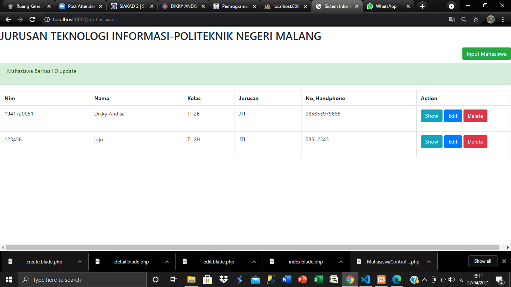
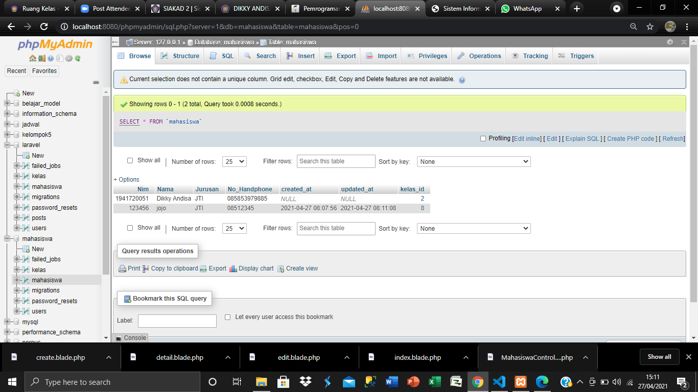
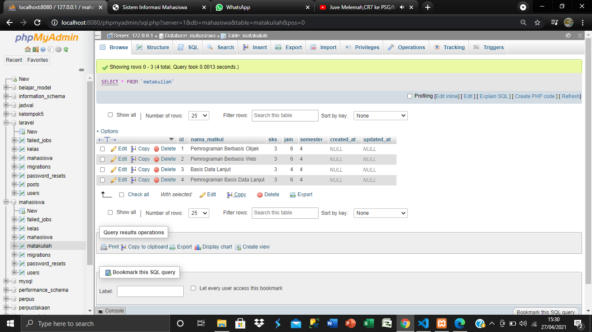

# 09 - ORM dengan RELASI

## Tujuan Pembelajaran

1. Mahasiswa mampu memahami konsep ORM dengan relasi authentication
2. Mahasiswa mampu mengimplementasikan ORM dengan relasi

## Hasil Praktikum

### praktikum 1

[kode program](../../src/09_ORM_Relasi/web.php)
[kode program](../../src/09_ORM_Relasi/2021_04_26_061240_create_kelas_table.php)
[kode program](../../src/09_ORM_Relasi/2021_04_27_064906_relasi_kelas_mahasiswa_table.php)
[kode program](../../src/09_ORM_Relasi/create.blade.php)
[kode program](../../src/09_ORM_Relasi/detail.blade.php)
[kode program](../../src/09_ORM_Relasi/edit.blade.php)
[kode program](../../src/09_ORM_Relasi/index.blade.php)
[kode program](../../src/09_ORM_Relasi/kelas.php)
[kode program](../../src/09_ORM_Relasi/KelasSeeder.php)
[kode program](../../src/09_ORM_Relasi/Mahasiswa.php)
[kode program](../../src/09_ORM_Relasi/MahasiswaSeeder.php)

### praktikum 2

[kode program](../../src/07_ORM/2021_04_27_081433_create_matakuliah_table.php)
[kode program](../../src/09_ORM_Relasi/MataKuliahSeeder.php)

