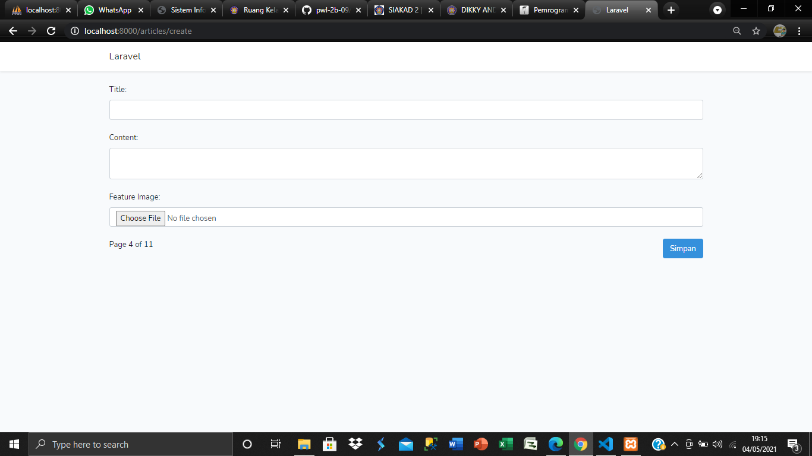
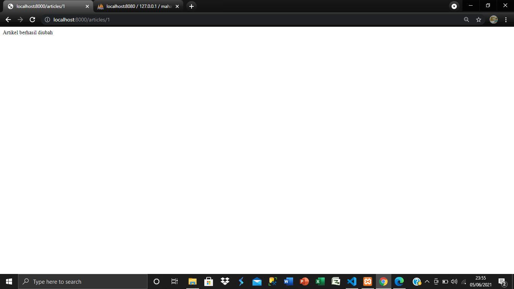
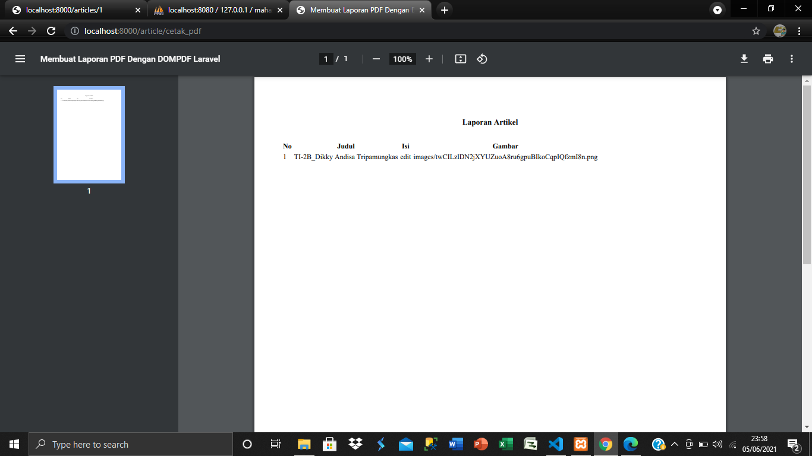
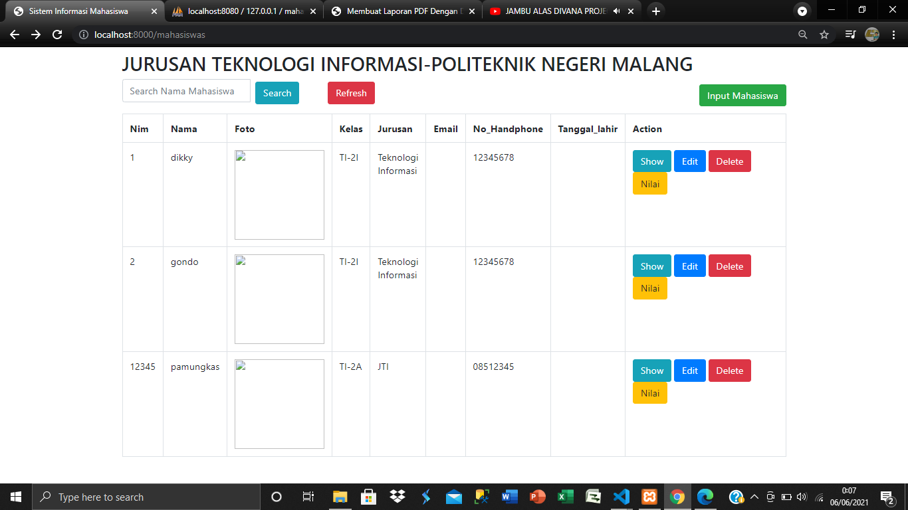
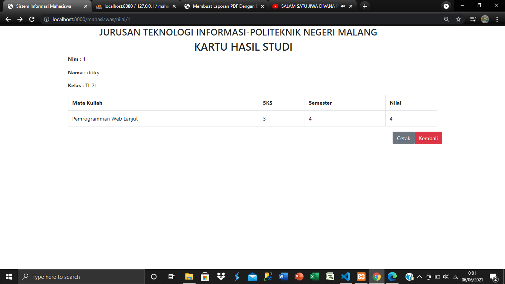
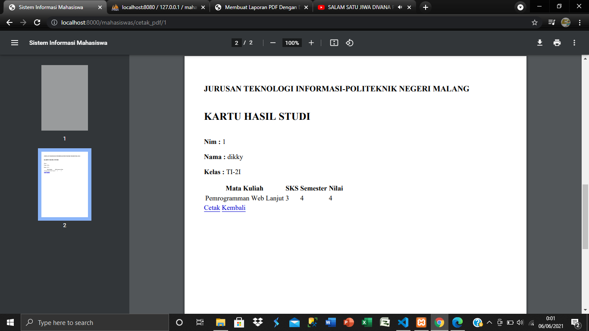

# 10 - Unggah Berkas dan Export PDF

## Tujuan Pembelajaran

1. Mahasiswa mampu membuat fitur unggah file dengan Web Framework Laravel
2. Mahasiswa mampu membangun fitur pelaporan berupa export file PDF

## Hasil Praktikum

### praktikum 1

[kode program](../../src/10_EXPORT/2021_05_04_115141_create_articles_table.php)
[kode program](../../src/10_EXPORT/Article.php)
[kode program](../../src/10_EXPORT/ArticleController.php)
[kode program](../../src/10_EXPORT/create,blade.php)
[kode program](../../src/10_EXPORT/web.php)

### praktikum 2

### praktikum 3

### tugas

