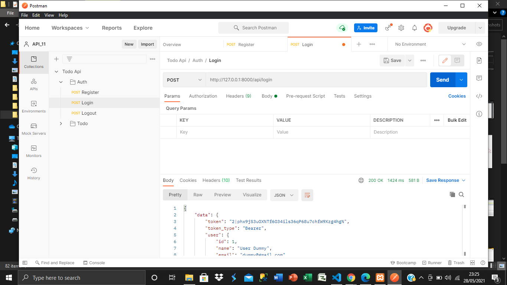
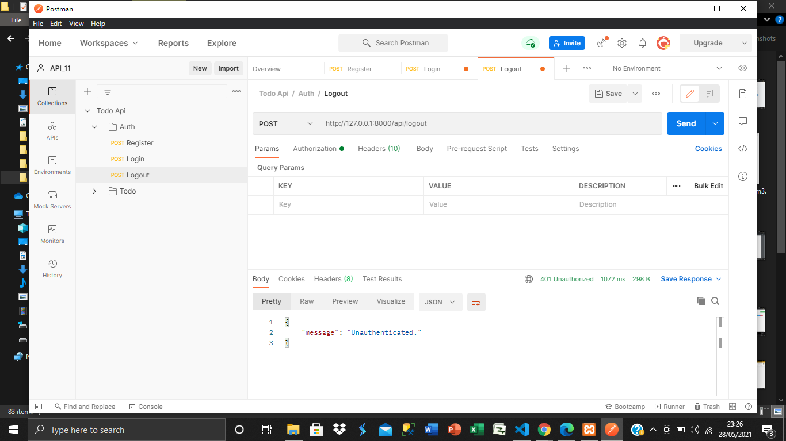
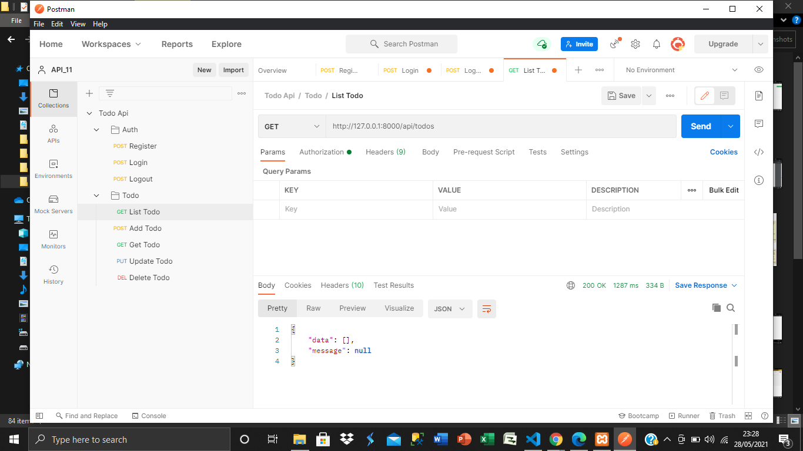
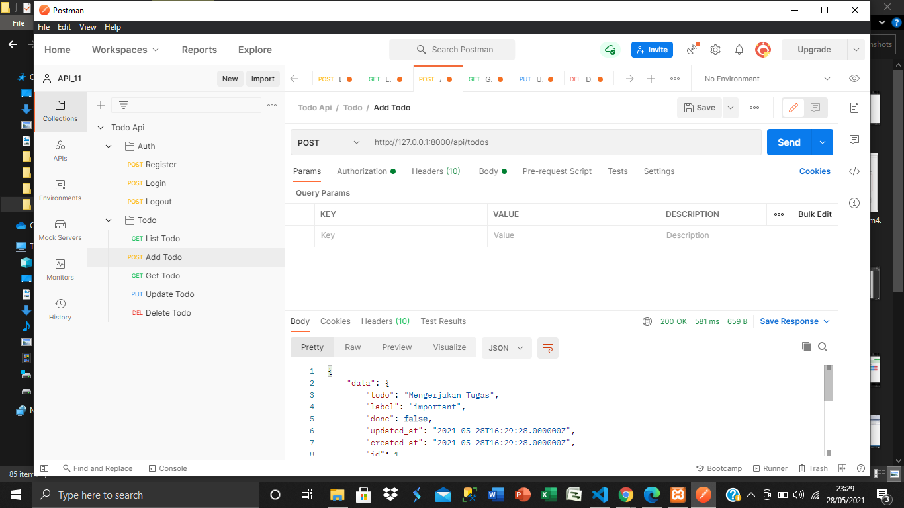
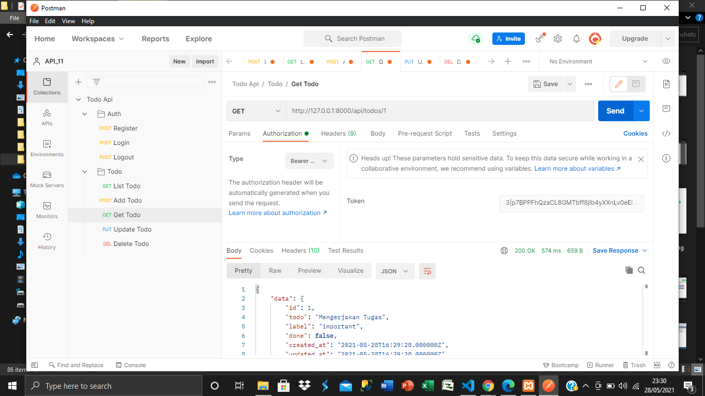
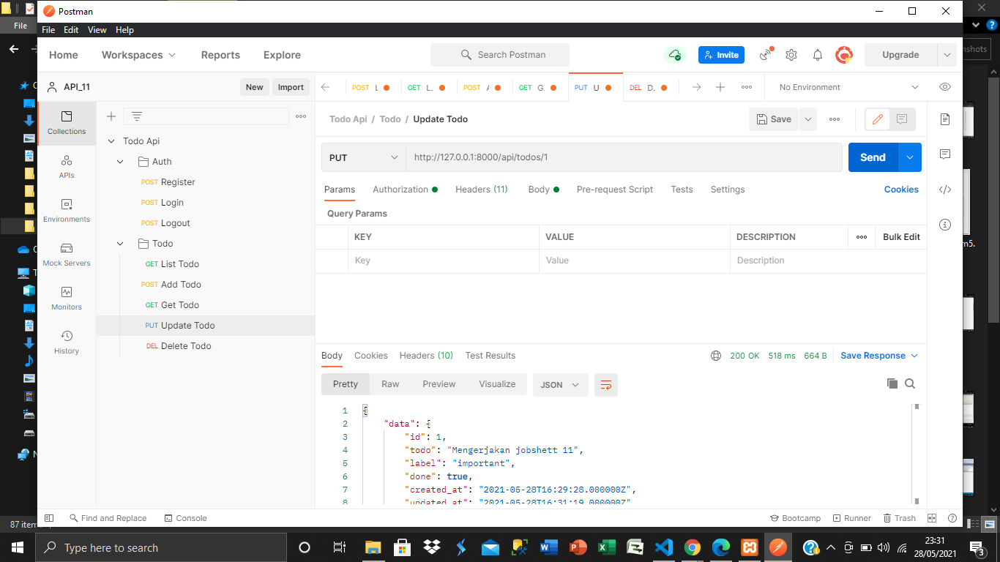
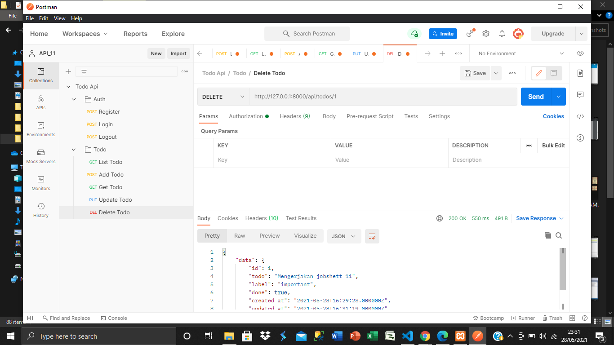
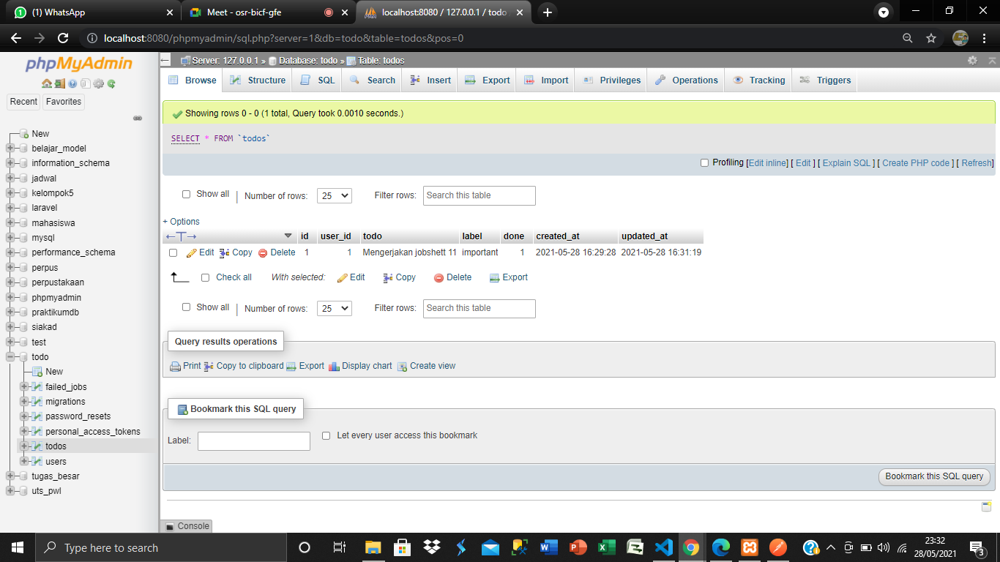

# 11 - RESTful API

## Tujuan Pembelajaran

1. Mahasiswa memahami konsep RESTful API
2. Mahasiswa mampu membangun autentikasi token pada RESTful API
3. Mahasiswa mampu membangun CRUD dengan RESTful aPI

## Hasil Praktikum

[kode program](../../src/11_API/User.php)
[kode program](../../src/11_API/Todo.php)
[kode program](../../src/11_API/api.php)
[kode program](../../src/11_API/ApiResponse.php)
[kode program](../../src/11_API/AuthController.php)
[kode program](../../src/11_API/TodoController.php)

